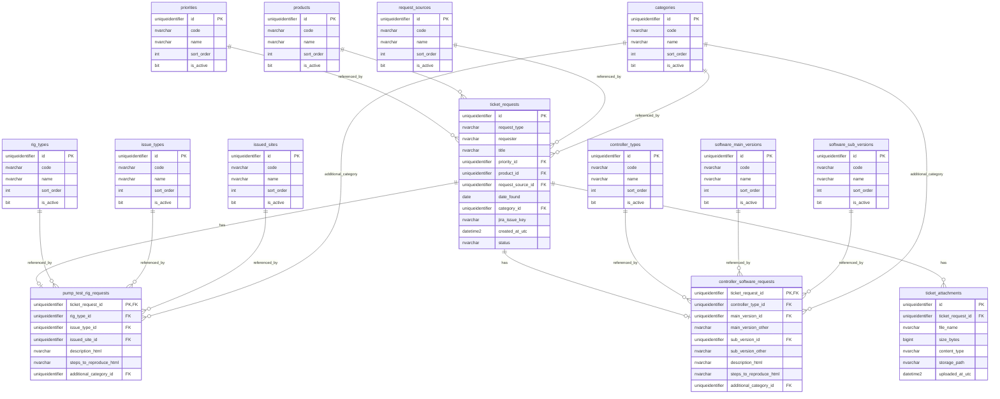

# SEM SW Ticket Request System Architecture (Phase 1)

## 1. System Architecture Diagram

```mermaid
flowchart LR
  User[Internal User] --> UI[UI Layer\nReact + TypeScript]
  UI --> SVC[Service Layer\nReact Query + API Client]
  SVC --> API[Backend API Layer\nASP.NET Core target / Current NestJS mock]
  API --> APP[Application Service Layer]
  APP --> REPO[Repository Layer]
  REPO --> DB[(Database Layer\nSQL Server target / mock seed now)]
  APP --> JIRA[Jira Integration Layer\nGateway Interface + Mock]
  JIRA -.future.-> JiraCloud[Jira Service Management API]
  APP --> FILES[File Storage Abstraction]
  FILES -.future.-> SharePoint[SharePoint / Object Storage]
  UI -.future.-> Entra[Microsoft Entra ID (Azure AD)]
  API -.future.-> Entra
```

## 2. Database ERD



## 3. Navigation Structure

- Ticket Request
- Pump Test Rig Request
- Controller Software Request

Current frontend routes:
- /ticket-request
- /ticket-request/pump-test-rig-request
- /ticket-request/controller-software-request

## 4. Wireframes

### 4.1 Ticket Request Hub

```text
+--------------------------------------------------------------+
| Ticket Request                                                |
| [Custom UX] [Jira-ready architecture]                        |
+--------------------------------------------------------------+
| Pump Test Rig Request Card  | Controller Software Request Card|
+--------------------------------------------------------------+
```

### 4.2 Pump Test Rig Request

```text
+-----------------------------------------------------------------------------------+
| Request Information (Requester, Title, Priority, Product, Source, Date, etc.)    |
+-----------------------------------------------------------------------------------+
| Description (Rich Text Editor + default template)                                 |
+-----------------------------------------------------------------------------------+
| Steps to Reproduce (Rich Text Editor)                                             |
+-----------------------------------------------------------------------------------+
| Additional Information (Category + Attachments)                                   |
+-----------------------------------------------------------------------------------+
| Submit                                                                             |
+-----------------------------------------------------------------------------------+
```

### 4.3 Controller Software Request

```text
+-----------------------------------------------------------------------------------+
| Request Information (Requester, Title, Priority, Product, Controller Type, etc.) |
+-----------------------------------------------------------------------------------+
| Software Version (Main Version, Sub Version, Other input conditionally visible)   |
+-----------------------------------------------------------------------------------+
| Description (Rich Text Editor)                                                    |
+-----------------------------------------------------------------------------------+
| Steps to Reproduce (Rich Text Editor)                                             |
+-----------------------------------------------------------------------------------+
| Additional Information (Category + Attachments)                                   |
+-----------------------------------------------------------------------------------+
| Submit                                                                             |
+-----------------------------------------------------------------------------------+
```

## 5. Database Schema (SQL Server draft)

```sql
CREATE TABLE dbo.products (
  id UNIQUEIDENTIFIER NOT NULL PRIMARY KEY,
  code NVARCHAR(50) NOT NULL,
  name NVARCHAR(200) NOT NULL,
  sort_order INT NOT NULL,
  is_active BIT NOT NULL DEFAULT 1
);

CREATE TABLE dbo.controller_types (
  id UNIQUEIDENTIFIER NOT NULL PRIMARY KEY,
  code NVARCHAR(50) NOT NULL,
  name NVARCHAR(200) NOT NULL,
  sort_order INT NOT NULL,
  is_active BIT NOT NULL DEFAULT 1
);

CREATE TABLE dbo.rig_types (
  id UNIQUEIDENTIFIER NOT NULL PRIMARY KEY,
  code NVARCHAR(50) NOT NULL,
  name NVARCHAR(200) NOT NULL,
  sort_order INT NOT NULL,
  is_active BIT NOT NULL DEFAULT 1
);

CREATE TABLE dbo.request_sources (
  id UNIQUEIDENTIFIER NOT NULL PRIMARY KEY,
  code NVARCHAR(50) NOT NULL,
  name NVARCHAR(200) NOT NULL,
  sort_order INT NOT NULL,
  is_active BIT NOT NULL DEFAULT 1
);

CREATE TABLE dbo.categories (
  id UNIQUEIDENTIFIER NOT NULL PRIMARY KEY,
  code NVARCHAR(50) NOT NULL,
  name NVARCHAR(200) NOT NULL,
  sort_order INT NOT NULL,
  is_active BIT NOT NULL DEFAULT 1
);

CREATE TABLE dbo.issue_types (
  id UNIQUEIDENTIFIER NOT NULL PRIMARY KEY,
  code NVARCHAR(50) NOT NULL,
  name NVARCHAR(200) NOT NULL,
  sort_order INT NOT NULL,
  is_active BIT NOT NULL DEFAULT 1
);

CREATE TABLE dbo.issued_sites (
  id UNIQUEIDENTIFIER NOT NULL PRIMARY KEY,
  code NVARCHAR(50) NOT NULL,
  name NVARCHAR(200) NOT NULL,
  sort_order INT NOT NULL,
  is_active BIT NOT NULL DEFAULT 1
);

CREATE TABLE dbo.priorities (
  id UNIQUEIDENTIFIER NOT NULL PRIMARY KEY,
  code NVARCHAR(50) NOT NULL,
  name NVARCHAR(200) NOT NULL,
  sort_order INT NOT NULL,
  is_active BIT NOT NULL DEFAULT 1
);

CREATE TABLE dbo.software_main_versions (
  id UNIQUEIDENTIFIER NOT NULL PRIMARY KEY,
  code NVARCHAR(50) NOT NULL,
  name NVARCHAR(200) NOT NULL,
  sort_order INT NOT NULL,
  is_active BIT NOT NULL DEFAULT 1
);

CREATE TABLE dbo.software_sub_versions (
  id UNIQUEIDENTIFIER NOT NULL PRIMARY KEY,
  code NVARCHAR(50) NOT NULL,
  name NVARCHAR(200) NOT NULL,
  sort_order INT NOT NULL,
  is_active BIT NOT NULL DEFAULT 1
);

CREATE TABLE dbo.ticket_requests (
  id UNIQUEIDENTIFIER NOT NULL PRIMARY KEY,
  request_type NVARCHAR(40) NOT NULL,
  requester NVARCHAR(120) NOT NULL,
  title NVARCHAR(500) NOT NULL,
  priority_id UNIQUEIDENTIFIER NOT NULL,
  product_id UNIQUEIDENTIFIER NOT NULL,
  request_source_id UNIQUEIDENTIFIER NOT NULL,
  date_found DATE NULL,
  category_id UNIQUEIDENTIFIER NOT NULL,
  jira_issue_key NVARCHAR(40) NULL,
  status NVARCHAR(40) NOT NULL,
  created_at_utc DATETIME2 NOT NULL,
  CONSTRAINT FK_ticket_requests_priority FOREIGN KEY (priority_id) REFERENCES dbo.priorities(id),
  CONSTRAINT FK_ticket_requests_product FOREIGN KEY (product_id) REFERENCES dbo.products(id),
  CONSTRAINT FK_ticket_requests_source FOREIGN KEY (request_source_id) REFERENCES dbo.request_sources(id),
  CONSTRAINT FK_ticket_requests_category FOREIGN KEY (category_id) REFERENCES dbo.categories(id)
);
```

## 6. REST API Specification (Phase 1 mock)

Base path:
- /api/ticket-requests

Endpoints:
- GET /master-data
  - Response: TicketRequestMasterData
- POST /pump-test-rig
  - Request: PumpTestRigRequestPayload
  - Response: TicketRequestSubmissionResponse
- POST /controller-software
  - Request: ControllerSoftwareRequestPayload
  - Response: TicketRequestSubmissionResponse

Planned Jira endpoints (Phase 2+):
- POST /jira/issues
- POST /jira/issues/{issueKey}/attachments
- PATCH /jira/issues/{issueKey}
- GET /jira/issues/{issueKey}/status
- GET /jira/issues/{issueKey}/comments

## 7. Frontend Component Structure

```text
frontend/src/
  App.tsx
  styles.css
  services/
    ticketRequestApi.ts
  pages (planned split)
    TicketRequestHubPage.tsx
    PumpTestRigRequestPage.tsx
    ControllerSoftwareRequestPage.tsx
  components (planned split)
    RichTextEditor.tsx
    RequestInfoSection.tsx
    AttachmentUploadField.tsx
```

Design notes:
- Form validation uses required checks and rich-text required checks.
- Master data is loaded from backend API via React Query.
- Attachment metadata is included in submission payload.
- Main/Sub version "Other" supports custom text entry.

## 8. Backend Project Structure

```text
backend/src/
  app.module.ts
  ticket-request/
    ticket-request.module.ts
    ticket-request.controller.ts
    ticket-request.service.ts
    ticket-request.repository.ts
    mock-seed.data.ts
    jira/
      mock-jira.gateway.ts
```

Layering implemented:
- Controller: HTTP contract
- Service: business orchestration
- Repository: mock DB seed source
- Jira gateway: interface-compatible mock implementation

## 9. Jira Integration Design

Integration strategy:
- Keep all Jira calls behind JiraTicketGateway abstraction.
- Service never depends on Jira SDK or HTTP clients directly.
- Add resilient policies later (retry, circuit-breaker, idempotency key).

Key interfaces already prepared:
- createIssue
- uploadAttachments
- updateIssue
- syncStatus
- getComments

Future production concerns:
- OAuth or PAT secure secret management
- request/response audit logging
- rate-limit and retry handling
- mapping table between internal ticket_request.id and jira_issue_key

## 10. Future Enhancement Roadmap

Phase 1 (completed now):
- New navigation and request pages
- Required validation and attachment metadata support
- Rich text support
- Seed-backed master data API
- Jira integration abstraction with mock implementation

Phase 2:
- Real DB persistence (SQL Server via EF Core target architecture)
- Real file storage provider
- Jira create issue + attachment upload
- Entra ID auth integration and requester auto-fill

Phase 3:
- Ticket lifecycle and status sync dashboard
- Comment synchronization
- Notification workflow (email/Teams)
- Admin UI for master data CRUD

Phase 4:
- SLA metrics, approval workflow, and analytics
- Workflow automation and role-based routing
- Operational monitoring and security hardening

## Notes

- Screenshot-based pixel-level matching could not be executed because attached reference images are not present in this repository context.
- Current implementation is architected so forms and APIs are directly replaceable with real persistence and Jira integrations without routing/UI redesign.
